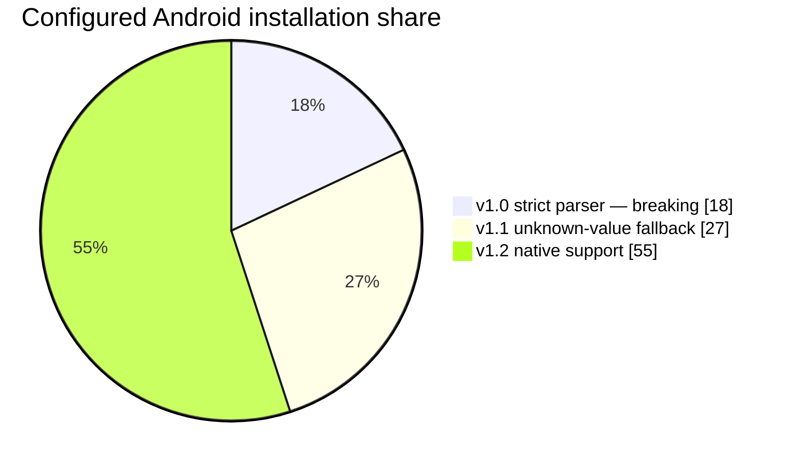
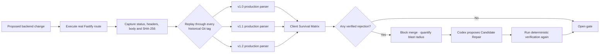
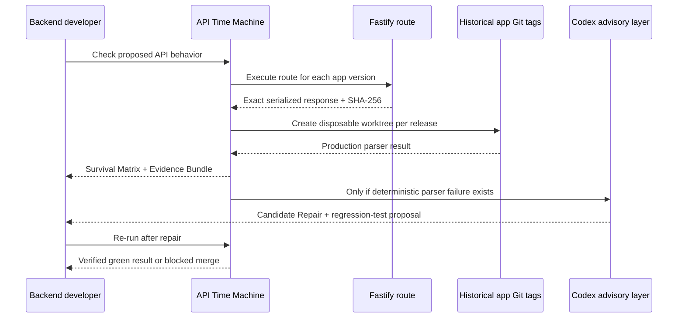

# API Time Machine

> **CI for mobile clients you can no longer update.**

API Time Machine executes the exact response produced by a proposed backend change, replays those bytes through real parsers from shipped React Native releases, and blocks a merge before an already-installed client breaks.

<p align="center">
  <a href="#the-proof"><strong>See the proof</strong></a> ·
  <a href="#run-it"><strong>Run it</strong></a> ·
  <a href="#how-it-works"><strong>How it works</strong></a>
</p>

---

## The problem

A backend can deploy in minutes. A mobile app installed on thousands of devices may remain unchanged for months.

When an API adds a new enum value, a current client may work perfectly while an older app's production runtime parser rejects the exact same response. Schema diffs can warn about this; they do not execute the real server response through the parser shipped in each historical app release.

API Time Machine does.

## The proof

Our demo evolves identity-verification status with a new value: `MANUAL_REVIEW`.

| Historical React Native release | Production parser behavior | Configured Android share | Breaking backend | Repaired backend |
| --- | --- | ---: | --- | --- |
| `app-v1.0.0` | Strict Zod enum | 18% | **Incompatible** | Compatible (`PENDING`) |
| `app-v1.1.0` | Unknown-value fallback | 27% | Compatible | Compatible |
| `app-v1.2.0` | Native `MANUAL_REVIEW` support | 55% | Compatible | Compatible |



<details open>
<summary><strong>Breaking run — merge blocked</strong></summary>

```text
Gate: INCOMPATIBLE | Blast radius: 18.00%

v1.0.0   incompatible   18.00%   Production parser rejected the captured response
v1.1.0   compatible     27.00%   Production parser accepted the captured response
v1.2.0   compatible     55.00%   Production parser accepted the captured response

exit code: 1
```

</details>

<details>
<summary><strong>Repaired run — gate reopened</strong></summary>

```text
Gate: COMPATIBLE | Blast radius: 0.00%

v1.0.0   compatible   18.00%
v1.1.0   compatible   27.00%
v1.2.0   compatible   55.00%

exit code: 0
```

</details>

The percentages are a checked-in sample Android adoption configuration, not live telemetry.

## How it works



### What makes the result trustworthy

| Codex can do | Deterministic engine decides |
| --- | --- |
| Analyze a grounded backend change | Execute the real Fastify route |
| Propose a narrowly scoped Candidate Repair | Hash the exact response bytes |
| Generate a regression-test suggestion | Run each historical production parser |
| Explain why a legacy projection is safe | Set the CI exit code and merge gate |

**Codex proposes. Fastify and historical React Native parsers decide.**

## Run it

### 1. Install and verify the repository

```bash
pnpm install --frozen-lockfile
pnpm check
```

### 2. Verify the repaired, green path

```bash
pnpm --filter @atm/cli start check
```

This writes an inspectable Evidence Bundle to `runs/<run-id>/`:

```text
runs/<run-id>/
├── manifest.json          # machine-readable run, shares, revisions and hashes
├── survival-matrix.md     # human-readable result
├── run-view.json          # sanitized dashboard artifact
└── captures/
    └── <sha256>.json      # exact captured HTTP response
```

### 3. Reproduce the red path

```bash
git fetch origin demo/historical-breaking
git switch demo/historical-breaking
pnpm install --frozen-lockfile
pnpm --filter @atm/cli start check
```

Expect an **18% blast radius** and exit code **1**. Return to the repaired branch and run the same command to see all releases pass with exit code **0**.

<details>
<summary><strong>Optional: run the Codex advisory workflow</strong></summary>

The Codex layer is intentionally advisory and runs in a read-only environment. It returns schema-validated analysis and a Candidate Repair; it never marks a run as verified by itself.

```bash
pnpm --filter @atm/codex demo       # fixture-backed, no API key
pnpm --filter @atm/codex eval       # deterministic policy/evaluation suite
```

For a guarded live evaluation, follow [`packages/codex/README.md`](packages/codex/README.md). Never place an API key in Git, browser code, a mobile app, or a committed `.env` file.

</details>

### Attach another repository

The backend and mobile applications in this repository remain proof-of-concept fixtures. The CLI reaches them through configured executable adapters, the same interface used by another repository.

```bash
api-time-machine init
api-time-machine doctor
api-time-machine check
api-time-machine dashboard
```

Historical clients may live in the backend monorepo, a sibling checkout, or a separate remote Git repository. See [Portable integration](docs/portable-integration.md) for the configuration and command protocol.

## How we built it



The implementation is deliberately narrow and auditable:

1. A real Fastify route is executed in-memory and its exact response is captured.
2. Each configured React Native release is checked out from an immutable Git tag in a disposable worktree.
3. A temporary Vitest probe calls that tag's real `parseVerificationResponse` production entry point.
4. The orchestrator classifies results as `compatible`, `incompatible`, or `inconclusive`; inconclusive never becomes a pass.
5. Every run preserves command output, response hashes, historical revisions, configured shares, and a matrix under `runs/`.

## Architecture

```text
apps/backend      Real Fastify route + legacy serialization policy
apps/mobile       React Native production parser history
apps/cli          One-command compatibility gate
packages/orchestrator
                  Worktrees · probes · hashes · evidence · blast radius
packages/codex    Read-only analysis · repair policy · Candidate Repair
apps/dashboard    Focused Client Survival Matrix presentation
```

## CI behavior

The historical-gate CI workflow is ready on `workstream/ci-gate`: it fetches immutable historical tags, then runs repository checks and the compatibility gate. A verified parser rejection returns **1**. A missing tag, timeout, malformed evidence, or toolchain error returns **2**. Only a fully compatible matrix returns **0**.

## Honest limitations

- This MVP proves one response-compatibility class: an added enum value.
- Installation shares are sample configuration, not live analytics.
- It exercises the React Native TypeScript data layer—not an emulator, native bridge, or device farm.
- A Candidate Repair is never automatically merged or called verified until deterministic backend and historical-client checks pass.

## Team workflow

| Area | Ownership |
| --- | --- |
| Backend capture and legacy projection | Backend |
| Historical app tags and matrix presentation | Client/UI |
| Codex analysis, repair policy and evaluation | MLOps |
| Worktrees, evidence, CLI and CI gate | Integration |

Read [the product requirements](docs/PRD.md), [domain context](CONTEXT.md), and [workstream guide](docs/WORKSTREAMS.md) for the implementation contract.
